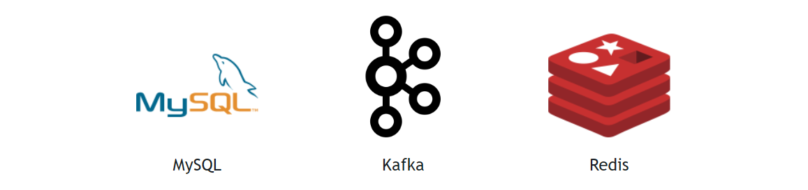
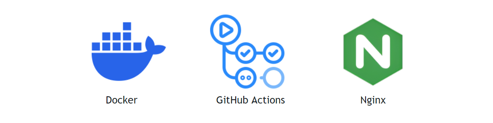

# 목차

- 개요
- 프로젝트 목표
- 설계
    - 아키텍처
    - ERD
    - API 명세
- 주요기능
- 기술선택과정
- 이슈 및 해결
- 팀원소개

# 프로젝트 소개

**“세상의 모든 뉴스가 AI로 새로워집니다.”**

우리는 디지털 콘텐츠 시대에서 빠르고 개인화된 형태로 정보전달이 이루어집니다. 하지만 콘텐츠 개인화는 비용과 시간이 많이 드는 일이죠. 본 프로젝트는 이 문제를 AI기술(음성 합성, 배경 생성, 아바타 구현)을 활용해 입력된 기사만 있으면 사용자 맞춤형 고품질 영상 뉴스 콘텐츠를 자동으로 만들 수 있도록 하였습니다.

## 프로젝트 목표

- 음성 합성, 배경 생성, 아바타 구현을 통해 AI 모델을 활용하여 사용자 맞춤형 콘텐츠를 제작한다.

# 설계

## 아키텍쳐

## ERD

## 모듈 구조

- **charmander-common :**
    - 다른 모듈들이 가장 많이 의존하는 기반 모듈, 공통 코드, 예외 코드가 존재합니다.

- **charmander-infra:**
    - charmander-file-strorage는 파일 처리, 미디어 관련 처리를 담당하는 모듈입니다.
    - charmander-kafka는 카프카 설정과 의존성 관련 모듈입니다.
    - charmander-docs는 api 문서 관련 설정을 가지는 모듈입니다.
- **charmander-domain:**
    - charmander-domain-common는 도메인에서 공통적으로 사용하는 기능을 가지는 모듈입니다. (ex baseEntity, AttributeConverter)
    - charmander-domain-core는 비즈니스 관련 도메인 객체가 포함된 모듈입니다.
- **charmander-api:**
    - charmander-sqs는 AWS SQS 처리를 담당하는 모듈입니다.
    - charmander-api-video는 비디오 생성을 처리하는 모듈입니다.
    - charmander-api-common은 api 모듈에서 공통적으로 사용하는 기능을 포함하는 모듈입니다.
    - **charmander-api-core 는 서비스에서 사용하는 기능이 포함된 모듈입니다.**

# 기술 선택 과정?

- JSpecify
- DB다루는 방법 MyBatis vs JPA vs jOOQ
- Kafka

## 기술 스택

back

DB

infra

aws

# 이슈 및 해결

- 뉴스 스크립트 자동 저장 구현시 동시성 이슈와 비동기 처리

    # 요구사항

    뉴스 기사 스크립트 작성시 거의 실시간으로 DB에 저장 되어야 한다.

    # 발생할 수 있는 문제점

    ## 문제1

    - 뉴스 기사는 스크립트 작성 후 멈추는 순간 서버로 자동 전송된다.
    - 만약 네트워크의 지연 또는 알 수 없는 이유로 서버로 보내지는 데이터가

        작성된 순서가 아닌  랜덤으로 서버에서 처리하게 된다면?

    - 실제 작성된 뉴스 스크립트와 DB에 저장된 데이터가 서로 다를 수 있는 문제점 발생

    ## 문제2

    - 만약 수정API 요청이 무수히 많이 발생하여 트랜잭션 충돌이 발생 한다면

        데이터를 어떻게 처리할 것인가?

    # 문제 해결을 위한 시도

    ## 문제1 해결 시도

    ### 생각1

    - 처음은 트랜잭션을 순서를 제어하면 되지 않을까 하는 생각을 먼저 했었다.
    - 그래서 카프카와 같은 메시지 큐를 활용을 하면 간단하게 해결될 것 같았다.
    - 그러나 팀원들 또는 멘토님들과 상의 후 메시지 큐를 활용한 방법은 제일 최후의 수단으로 고려하고 다른 방법을 시도해 보라고 권유 받았다.

    ### 생각2

    - 트랜잭션을 제어하지 못한다면 어떻게 해야할까 고민
    - 랜덤으로 트랜잭션을 처리 하더라도 결국엔 마지막 데이터만 최종적으로 구별할 수 있다면 중간값이 손실 되더라도 상관 없을 것 같다는 생각을 하였다.

    ### 문제1 해결

    생각2를 바탕으로 SQL 쿼리 문으로

    - 마지막 수정 시간 > timestamp
    - 마지막 수정 시간보다 좀 더 빠른 시간의 timestamp 트랜잭이 오면 처리하지 않는 방향으로 로직을 작성 하였다.
    - 즉 제일 최신 시간의 트랜잭션만 DB에 반영 하도록 만든 것이다.

    ## 문제2 해결 시도

    - 동시성 문제를 해결하기 위해 lock을 활용하여 동기적 처리 시도
    - 일단 뉴스 스크립트는 여러 사용자가 아닌 사용자 한명만 수정 하는 것이기 때문에 동시성 충돌이 많이 발생하지 않는 다고 판단하였다.
    - 그래서 충돌이 자주 발생하지 않는다는 가정 하에 사용하는 낙관락을 사용 하였다.
    - 그렇지만 혹시나 여러 번의 충돌이 발생할 것을 대비하여 낙관락이 5번 이상 충돌시 비관적 락을 사용하도록 매커니즘을 구현하게 되었다.

    ### 문제 2-1 : 또다른 문제 발생 @Version

    - 낙관락을 사용 했을 시 @Version을 사용하면 데이터 충돌시 하이버네이트에서 자체적으로 처리하여 롤백시키기 때문에 try catch문으로 예외 처리 로직이 실행될 수 없는 문제가 발생

    ### 문제2, 2-1: 해결

    - @Version을 사용하는 것을 포기하고 timestamp를 활용하여 락을 구현하는 것을 채택
    - 이제 데이터가 처리되기 전에 timestamp를 비교하여 같은 timestamp인 경우 충동을 일으켜 try catch문으로 예외 처리가 가능하게 되었다.
    - 이제 5번의 충돌 발생시 데이터를 비관적락(named 락)을 활용하여 동기적으로 데이터를 처리 할 수 있게 됨으로써 동시성 문제를 해결 하였다.

## API 명세

### **1. 프로젝트 API**

- **GET /api/v1/projects**

    → 사용자가 생성한 혹은 접근 가능한 전체 프로젝트 목록을 조회합니다.

- **GET /api/v1/projects/{id}**

    → 특정 프로젝트의 상세 정보를 조회합니다.

- **POST /api/v1/projects**

    → 새로운 프로젝트를 생성합니다.

- **POST /api/v1/projects/{id}/generate-video**

    → 특정 프로젝트에 대해 비디오 생성 작업을 시작합니다.

- **PATCH /api/v1/projects/{id}**

    → 프로젝트의 일부 정보를 수정합니다.

- **PATCH /api/v1/projects/{id}/newsArticle**

    → 프로젝트에 연결된 뉴스 기사를 수정합니다.

- **DELETE /api/v1/projects/{id}**

    → 특정 프로젝트를 삭제합니다.

---

## **2. 장면 API**

한 프로젝트는 여러 장면을 가질 수 있습니다. (1:N)

장면은 영상의 특정 구간을 의미합니다.

- **GET /api/v1/projects/{projectId}/scenes**

    → 특정 프로젝트에 속한 장면 목록을 조회합니다.

- **POST /api/v1/projects/{projectId}/scenes**

    → 프로젝트에 새로운 장면을 추가합니다.

- **PATCH /api/v1/projects/{projectId}/scenes/{sceneId}**

    → 특정 장면을 수정합니다.

- **DELETE /api/v1/projects/{projectId}/scenes/{sceneId}**

    → 특정 장면을 삭제합니다.

---

## **3. 대사 API**

각 장면은 여러 개의 대사를 가질 수 있습니다. (1:N)

대사는 TTS로 음성을 생성할 일련의 문자열을 의미합니다.

- **POST /api/v1/projects/{projectId}/scenes/{sceneId}/ts**

    → 특정 장면에 대사를 추가합니다.

- **PATCH /api/v1/projects/{projectId}/scenes/{sceneId}/ts/{tsId}**

    → 특정 대사를 수정합니다.

- **DELETE /api/v1/projects/{projectId}/scenes/{sceneId}/ts/{tsId}**

    → 특정 대사를 삭제합니다.

---

## **4. 파일 업로드 API**

- **GET /api/v1/files/my**

    → 사용자가 업로드한 파일 목록을 조회합니다.

- **GET /api/v1/files/my/{fullPath}**

    → 사용자가 업로드한 특정 파일의 상세 정보를 조회합니다.

- **GET /api/v1/files/upload-id**

    → 새로운 파일 업로드를 위한 고유 ID를 요청합니다.

- **GET /api/v1/files/upload-url**

    → 업로드 ID로 실제 업로드를 수행할 수 있는 URL 목록을 요청합니다.
    빠른 업로드를 위해 최대 100개의 분할 업로드가 가능합니다.

- **POST /api/v1/files/complete**

    → 진행 중인 파일 업로드를 완료합니다.

- **POST /api/v1/files/abort**

    → 진행 중인 파일 업로드를 중단합니다.

# 팀원 소개

|  | email | 블로그 | 깃헙 |
| --- | --- | --- | --- |
| 박서윤  | wideskyinme@gmail.com | https://5ddugi.tistory.com/ | https://github.com/SeoYoonP |
| 박재홍 | [ghddlfkdn@gmail.com](mailto:ghddlfkdn@gmail.com) |  | https://github.com/StarlitDreamerGalaxyWanderer |
| 변재호 | jaho321@naver.com |  | https://github.com/jaho96 |
| 윤여일 | dudlf016@gmail.com |  | https://github.com/dudlf |
